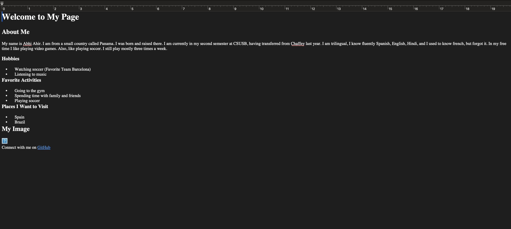

# About Me

PROVIDE OVERVIEW OF ASSIGNMENT HERE

Time spent:  3.5 hours spent in total

## Features

The following **required** features are completed:

- [ x] Modifies title in head so that the tab has a unique name, (e.g. About Me). (1pts)
- [ x] Uses a mix of headers, paragraphs, and div's. (3pts)
- [] Includes at least 3 paragraphs. (3pts)
- [x] Includes at least one image. (2pts)
- [ x] Includes a .css file to style with at least 4 ways to format the elements in the html. (3pts)
- [x ] Includes a link that directs to your Github account (can be main account or specifically to your Platform_Computing Repo). (3pts)

The following **bonus** features are implemented:

- [x] Applies different font(s). (0.5 pt)
- [x] Applies border and margins. (0.5 pt)
- [] DESCRIBE ANY OTHER FEATURES HERE.

## Screenshot and/or Video Walkthrough

## Notes:
PROVIDE RELEVANT OR ADDITIONAL INFORMATION HERE. Below are formatting options to add emphasis in text

I changed many colors on my webpage, but nothing cahnged. To me the code looks fine. I don't know if it is because i am on a mac or that when i opened the web page it was on dark mode. I creating a folder for images just like you said, but i kept on saying that i needed to create a new file, so I dragged it out of the folder called images.

<ul>
  <li>**Example in bold**</li>
  <li>*Example in italics*</li>
</ul>
